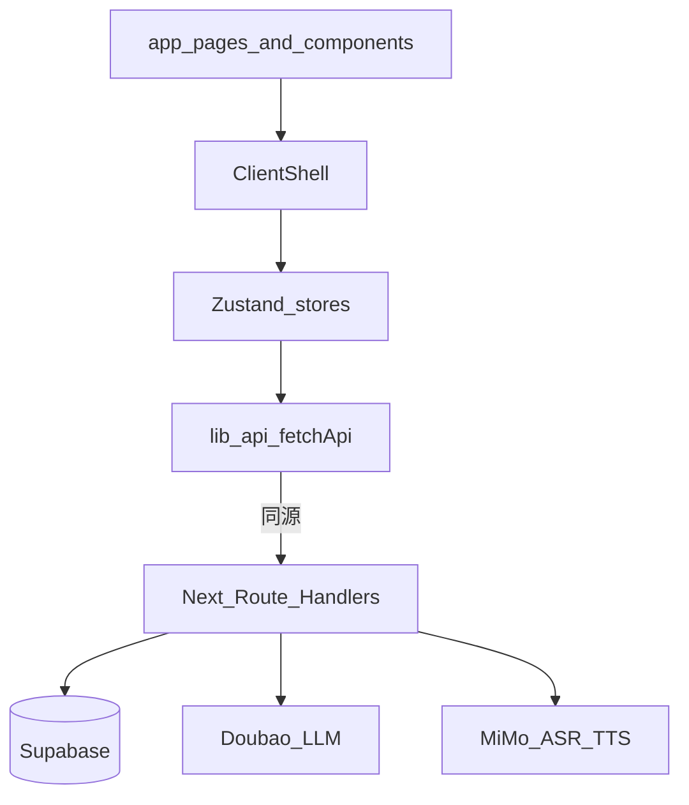

# 桑梓智护 — 项目结构详解

> 最后更新: 2026-07-13
> 包名: `sangzi-smart-care` · APP 名: 智护银龄  
> 技术栈: Next.js ≥16.2 + React 19 + Zustand 5 + Supabase（全栈 Route Handlers）  
> 架构目标: **EdgeOne 全栈 Next.js** · Android **在线壳** · CSS Modules 为主 + Tailwind v4 工具层  
> API: 业务 API 全部在 Next `app/api/**`（历史 Python `backend/` 已删除）  
> 开发端口: Next **7742**  
> 配套: [功能详解](./功能详解.md) · [目标架构](../designs/target-architecture.md) · [AGENTS.md](../../AGENTS.md)

---

## 一、顶层目录总览

```
sangzi-smart-care/          # 仓库根（路径常为 OldersNews/app）
├── app/                    # Next App Router 页面 + app/api（业务 API 落点）
├── components/             # 可复用 UI（按业务域）
├── hooks/ · lib/ · stores/ · styles/ · types/
├── android/                # 在线 WebView 壳（打开 https）
├── supabase/migrations/    # 可审计、按顺序应用的 Supabase schema 变更
├── scripts/                # setup / build / deploy / dev
├── docs/                   # 详解 · designs · ops · archive …
├── AGENTS.md               # AI / 工程规范
├── edgeone.json            # EdgeOne 全栈部署
├── next.config.ts          # 全栈（禁止 output:export）
├── package.json
└── .env.example            # 环境变量模板（真实密钥用 .env.local）
```

### 运行时壳层

```
RootLayout (app/layout.tsx · Server)
  └── ClientShell (components/providers/ClientShell.tsx · Client)
        ├── AuthProvider → useAuth（路由守卫）
        ├── ErrorBoundary
        ├── <main class="page-content">{children}</main>
        └── TabBar（角色自适应；部分路径隐藏）
```

主题：`document.documentElement` 上 `data-theme="elder" | "family"`，由 ClientShell / `userStore.setRole` 写入。

---

## 二、前端页面路由 (`app/`)

App Router 文件系统路由。业务数据经 Next.js Route Handlers（`app/api`），不直连 Supabase CRUD（Realtime 客户端另见 `lib/`）。

```
app/
├── layout.tsx              # 服务端薄壳 → ClientShell
├── page.tsx                # 首页分流：FamilyHomeView | ElderHomeView
├── page.module.css
│
├── login/                  # 图形验证码 + 邮箱 OTP
├── onboarding/             # Elder / Family 角色选择
│
├── health/                 # 健康看板
│   └── input/              # 手动 + 语音录入
├── medicine/               # 今日用药
│   └── history/            # 计划历史
├── messages/               # 联系人列表
│   └── [id]/               # 聊天（ChatDetail 客户端组件）
├── radio/                  # 健康广播（无 Tab 入口）
├── voice/                  # AI 语音助手（全屏，TabBar 隐藏）
├── family/
│   └── [id]/               # 家人详情（FamilyDetailClient）
└── settings/
    ├── profile/            # 个人信息
    ├── bind/               # 绑定管理
    └── accessibility/      # 字号 / 语速
```

### 路由总表

| 路由 | Tab | Elder | Family | 功能 |
|------|-----|-------|--------|------|
| `/` | ✓ | 语音优先首页 | 看板首页 | 角色分流首页 |
| `/login` | 隐藏 | 共用 | 共用 | 验证码 + 邮箱 OTP |
| `/onboarding` | 隐藏 | 共用 | 共用 | 角色选择 |
| `/health` | ✓ | ✓ | ✓ | 健康看板 |
| `/health/input` | — | 主入口 | URL 可达 | 健康录入 |
| `/medicine` | Elder 中心 | ✓ | ✓ | 今日用药 |
| `/medicine/history` | — | ✓ | ✓ | 用药历史 |
| `/messages` | ✓ | 「亲属」 | 「消息」 | 联系人 |
| `/messages/[id]` | — | ✓ | ✓ | 聊天详情 |
| `/radio` | — | 直达 | 直达 | 健康广播 |
| `/voice` | Family 中心；页内隐藏 Tab | 首页球进入 | Tab 中心 | AI 助手 |
| `/family/[id]` | — | ✓ | ✓ | 家人详情 |
| `/settings` | ✓ | ✓ | ✓ | 设置 |
| `/settings/profile` | — | ✓ | ✓ | 资料 |
| `/settings/bind` | — | 生成码 | 输入码 | 绑定 |
| `/settings/accessibility` | — | ✓ | 可访问 | 无障碍 |

### TabBar（`components/layout/TabBar.tsx`）

| 角色 | Tab 顺序 |
|------|----------|
| Elder | `/` 语音 · `/messages` 亲属 · **`/medicine` 功能** · `/health` 看板 · `/settings` 我的 |
| Family | `/` 看板 · `/messages` 消息 · **`/voice` 语音** · `/health` 健康 · `/settings` 设置 |

隐藏 TabBar 的路径包括：`/login`、`/onboarding`、`/voice`。

### 全栈与路由注意

- **禁止**生产默认使用 `output: 'export'`；EdgeOne 全栈产物为 `.next`
- Android / 浏览器访问线上 https，不再依赖 `generateStaticParams` 枚举全部动态 id
- 动态路由由全栈 SSR/CSR 直接处理，无需静态枚举

---

## 三、组件层 (`components/`)

按业务域分组；样式多为 **TSX + CSS Module**。

### 页面已挂载（生产路径引用）

```
components/
├── providers/
│   ├── ClientShell.tsx     # 主题 + Auth + ErrorBoundary + TabBar
│   ├── AuthProvider.tsx
│   └── ErrorBoundary.tsx
├── layout/
│   ├── TabBar.tsx
│   └── PageHeader.tsx
├── home/
│   ├── ElderHomeView.tsx   # 问候 / 时间 / 语音球 / SOS 占位
│   └── FamilyHomeView.tsx  # 绑定老人 / 用药摘要 / 趋势
├── ui/
│   ├── Button.tsx · Input.tsx · LoadingSpinner.tsx
│   ├── DataStateWrapper.tsx
│   └── index.ts
└── messages/
    ├── MessageList.tsx
    ├── ChatBubble.tsx      # 列表/气泡；ChatDetail 主要用 List + Recorder
    └── VoiceRecorder.tsx
```

### 库组件（有实现/测试，页面未挂载或未复用）

| 组件 | 说明 |
|------|------|
| `health/HealthCard.tsx` | 指标卡；看板未引用 |
| `medicine/PlanForm.tsx` | 用药计划表单完整；**无路由** |
| `medicine/ReminderModal.tsx` | 提醒弹窗；页面用内联 UI |
| `medicine/MedicineTimeline.tsx` | 时间线组件；页面未引用 |
| `voice/VoiceBall.tsx` · `VoicePanel.tsx` | Elder 首页内联球，未复用 |

**已删除 / 文档勿再写：** `EmergencyFAB`、`useEmergency`（不存在）。紧急能力见后端 API 与 [功能详解](./功能详解.md)。

---

## 四、自定义 Hooks (`hooks/`)

| Hook | 职责 | UI 挂载 |
|------|------|---------|
| `useAuth.ts` | token 初始化、登录/onboarding 跳转 | AuthProvider、设置子页 |
| `useFamilyBinds.ts` | 拉取绑定列表 | FamilyHomeView、messages |
| `useAIChat.ts` | AI 对话 / 意图 / 摘要 API | `/voice`（对话为主） |
| `useVoiceRecognition.ts` | `getUserMedia` 录音 → 同源 MiMo ASR；Web Speech 明确降级 | `/voice`、`/health/input`、消息录音 |
| `useTextToSpeech.ts` | 同源 MiMo MP3 TTS；Web Speech 明确降级 | `/voice`、用药提醒 |
| `useRealtimeSync.ts` | Supabase 频道 → 刷新 Store | **未挂载** |
| `useSwipeGesture.ts` | 滑动手势 | **未使用**（首页有提示文案） |

依赖关系（简化）：

```
useAuth ──→ userStore
useFamilyBinds ──→ familyStore
useAIChat ──→ api（+ 可选 summary）
useRealtimeSync ──→ supabase + 各 Store（待挂载）
```

---

## 五、工具层 (`lib/`)

| 模块 | 职责 | 状态 |
|------|------|------|
| `api.ts` | `fetchApi`：Bearer、401 刷新 | 核心，全 Store 使用 |
| `constants.ts` | `ROUTES`、阈值阈值、功能卡常量 | 使用中 |
| `supabase.ts` | 浏览器 Supabase 客户端 | 供 Realtime |
| `realtimeSubscriptions.ts` | 多表频道订阅 | 仅经 useRealtimeSync |
| `offlineSync.ts` | 离线队列 + online 重放 | **仅测试引用** |
| `voiceCapabilities.ts` | 检测 MiMo 主链路与 Web Speech 降级能力 | voiceStore |
| `intentHandlers.ts` | 意图 → 健康/用药/消息/紧急 | **仅测试引用** |
| `messageUtils.tsx` | 关系 Emoji、时间、预览 | 消息列表 |

---

## 六、状态管理 (`stores/`)

全部 **Zustand v5**，按域拆分。

| Store | 关键状态 | 主要 API |
|-------|----------|----------|
| `userStore` | user、token、`isElder`、持久化 | `/users/me`、`/me/role` |
| `healthStore` | latest、trend、loading | `/health/records/*` |
| `medicineStore` | plans、todayTimeline、progress | `/medicine/*` |
| `messageStore` | contacts、messages、unread | `/messages/*` |
| `familyStore` | binds、healthSummaries | `/family/binds` + health latest |
| `radioStore` | broadcasts、播放态 | `/radio/*` |
| `voiceStore` | ASR/TTS 能力等级 | `voiceCapabilities.detect` |
| `summaryStore` | AI 会话摘要 | `/ai/summary/:userId` — **UI 未用** |

类型：`types/health.ts`（体征联合类型与守卫）、`types/supabase.ts`（生成表类型）。

交叉流：

```
userStore
  ├── familyStore（userId → binds）
  ├── healthStore / medicineStore / messageStore
familyStore
  └── healthStore.fetchLatest（家属看老人）
```

---

## 七、设计系统 (`styles/`)

```
styles/
├── globals.css             # Design System v2：CSS 变量、.glass-card、
│                           # .page-content、safe-area；含 @import "tailwindcss"
├── elder-theme.css         # [data-theme="elder"] 暖橙
└── family-theme.css        # [data-theme="family"] 冷蓝
```

页面与组件样式以 **CSS Modules** 为主；Tailwind 作为 globals 工具层，**不是**「零 Tailwind」。

### 双主题色板（摘要）

| | Elder | Family |
|--|-------|--------|
| 背景 | `#FEF7F0` | `#F4F6FB` |
| 主色 | `#F5923E` | `#3B6AF5` |
| 主文字 | `#2D2016` | `#1A1F36` |

### CSS 变量前缀

| 分类 | 前缀 | 示例 |
|------|------|------|
| 间距 | `--space-` | `--space-md` |
| 圆角 | `--radius-` | `--radius-lg` |
| 字体 | `--font-` | `--font-body`、`--font-hero` |
| 颜色 | `--accent-` / `--text-` / `--bg-` | `--accent-primary` |
| 阴影 | `--shadow-` | `--shadow-card` |
| 动画 | `--duration-` | `--duration-fast` |

### 设计原则（产品侧）

| 原则 | 实现要点 |
|------|----------|
| 单屏核心操作 ≤ 2 | 每页主入口克制 |
| 适老化触控 | 目标区域偏大，表单字号 ≥ 16px |
| 毛玻璃 | `backdrop-filter` + 半透明底 |
| 动画 | 脉冲/过渡；应尊重 `prefers-reduced-motion` |

说明：`layout` metadata 中曾设 `userScalable: false`，与无障碍最佳实践冲突，属已知债务。

---

## 八、后端服务（历史 Python `backend/` 已删除）

> **现状**：业务 API 全部在 Next `app/api/v1/**`。历史 Python FastAPI `backend/` 目录已于 2026-07-12 删除（迁移计划见 [docs/plans/api-migration/12-cleanup.md](../plans/api-migration/12-cleanup.md)）。  
> **不要**恢复 Python `backend/`；新业务一律写在 `app/api/v1/<域>/route.ts` 与 `lib/server/*`。

### API 模块总表

| 前缀 | 落点 | 核心能力 |
|------|------|----------|
| `/api/v1/auth` | `app/api/v1/auth/**` | captcha、send-code、verify、refresh |
| `/api/v1/users` | `app/api/v1/users/**` | me、PATCH me、PATCH role |
| `/api/v1/family` | `app/api/v1/family/**` | generate-code、bind、binds CRUD |
| `/api/v1/messages` | `app/api/v1/messages/**` | 会话、send、send-voice、read、unread |
| `/api/v1/medicine` | `app/api/v1/medicine/**` | plans、today、records、notify-family |
| `/api/v1/health` | `app/api/v1/health/**` | records CRUD、latest、trend |
| `/api/v1/ai` | `app/api/v1/ai/**` | chat、intent、summary |
| `/api/v1/voice` | `app/api/v1/voice/**` | MiMo tts、transcribe、私有消息音频鉴权播放 |
| `/api/v1/emergency` | `app/api/v1/emergency/**` | trigger、cancel、notify、history |
| `/api/v1/radio` | `app/api/v1/radio/**` | recommend、categories、play-record、generate |

另：Next 侧提供 `GET /api/ping`（同源探活，无鉴权）。当前语音与 AI 都使用普通同源 HTTP Route Handler，没有 WebSocket 端点。

### 配置键（仅列名 · 目标命名）

`NEXT_PUBLIC_SUPABASE_URL`、`NEXT_PUBLIC_SUPABASE_PUBLISHABLE_KEY`、`SUPABASE_SECRET_KEY`（替代旧 anon/service_role）、`SUPABASE_VOICE_BUCKET`、`JWT_SECRET`、`MIMO_API_KEY`、`VOLCANO_ARK_*`、`SMTP_*`。详见 [ops/env-config.md](../ops/env-config.md)。

### 安全要点（结构视角）

- 受保护业务路由：Bearer JWT（`lib/server/auth.ts`）；`/api/ping` 与认证入口按用途公开
- MiMo TTS / ASR 与消息音频播放均要求 Bearer JWT，不存在无鉴权 WebSocket 语音旁路
- 服务角色绕过 RLS；跨用户 `?user_id=` 缺少完整家庭权限门控
- CAPTCHA / OTP 摘要由 `oc_auth_challenge_*` SECURITY DEFINER RPC 原子写入和消费；目标 Supabase 必须先应用对应 migration
- 语音对象只写入配置的 private Storage bucket，播放经业务鉴权后生成短期签名 URL

更细的成熟度与缺口见 [功能详解](./功能详解.md)。

---

## 九、Android 壳 (`android/`)

**模式 B**：Release WebView 固定加载 `https://sangzicare.husteread.com`；Debug 使用 `http://127.0.0.1:7742` 与 `adb reverse`。两者都不内嵌 `out/`。

- 旧 `lib/jsbridge.ts` 已移除，原生不注入业务 JavaScript bridge；页面使用标准 Web 导航、Cookie、`getUserMedia` 与同源 API
- ASR/TTS 由网页端统一访问服务端 MiMo；Android 只负责可信源、麦克风权限、生命周期、返回导航与错误页
- 说明：[android/README.md](../../android/README.md)

---

## 十、开发脚本 (`scripts/`)

按 `setup/` · `build/` · `deploy/` · `dev/` 分类。端口 **7742**。见 [scripts/README.md](../../scripts/README.md)。

---

## 十一、数据流架构



> 目标态：浏览器/WebView → EdgeOne 上的 Next（页面 + `app/api`）→ Supabase；见 [target-architecture.md](../designs/target-architecture.md)。

### 认证流

```
ClientShell / useAuth
  → userStore.initialize（localStorage token）
  → GET /users/me
  → 未登录 → /login（captcha → send-code → verify）
  → 无 role → /onboarding → PATCH /users/me/role
```

### 首页分流

```
app/page.tsx
  → family → FamilyHomeView（binds + 摘要）
  → else → ElderHomeView（语音球 → /voice）
```

### 已实现但未挂载

```
ClientShell 当前未调用：
  · useRealtimeSync / realtimeSubscriptions
  · offlineSync.startOfflineSync
  · intentHandlers（语音页未接）
```

---

## 十二、文件命名约定

| 类型 | 规则 | 示例 |
|------|------|------|
| 页面 | `page.tsx` + `page.module.css` | `app/health/page.tsx` |
| 组件 | `PascalCase.tsx` + Module CSS | `ChatBubble.tsx` |
| Hook | `use` + PascalCase | `useVoiceRecognition.ts` |
| Store | camelCase + `Store.ts` | `healthStore.ts` |
| 工具 | camelCase | `messageUtils.tsx` |
| 测试 | `*.test.ts(x)` | `page.test.tsx` |
| 服务端 | `route.ts` + `_lib.ts` | `app/api/v1/ai/chat/route.ts` |

---

## 十三、测试覆盖（范围说明）

| 区域 | 框架 / 位置 |
|------|-------------|
| 前端 / Next API | Vitest + Testing Library：`hooks/__tests__`、`lib/__tests__`、`stores/__tests__`、`app/**/__tests__`、`components/**/__tests__` |
| 服务端 | `lib/server/__tests__`（auth、认证挑战 migration 等）|

`package.json` 已内置 `npm test`（Vitest run），并提供 `npm run test:voice` 与真实环境专用的 `npm run test:voice:live`。历史 Python `backend/tests/` 已随 `backend/` 一并删除。

---

## 十四、数据库表（运行时代码视角）

共享库前缀 **`oc_`**（小护关爱 / 智护银龄）。`app/api` 与 `types/supabase.ts` 已对齐下列物理表名（2026-07）：

| 表 | 用途 |
|----|------|
| `oc_users` | 用户资料与适老化偏好 |
| `oc_auth_challenges` | CAPTCHA / OTP 的 HMAC 摘要、限流、版本与消费状态 |
| `oc_elder_family_binds` | 绑定码、关系、权限、状态 |
| `oc_health_records` | 体征 JSON `values`、异常标记 |
| `oc_medication_plans` / `oc_medication_records` | 计划与服药记录 |
| `oc_elder_care_messages` | 捂话 |
| `oc_emergency_calls` | 紧急呼叫记录 |
| `oc_health_broadcasts` / `oc_broadcast_play_history` | 广播与播放史 |
| `oc_ai_conversations` | AI 对话持久化 |

历史 `backend/` 下的 `database-init.sql` / `migration-*.sql` 已删除；新的 schema 变更从 `supabase/migrations/20260713230000_auth_challenges.sql` 起随仓库审计。migration 文件仍须由运维应用到目标 Supabase，不能把“已生成文件”视为“远端已执行”。映射说明见 [docs/ops/oc-table-prefix.md](../ops/oc-table-prefix.md)。

---

## 十五、重构与演进备忘（相对 2026-03 文档）

| 旧文档说法 | 现状 |
|------------|------|
| layout 挂 TabBar + EmergencyFAB | ClientShell 挂 TabBar；**无 EmergencyFAB** |
| `components/home/` 已清空 | **ElderHomeView / FamilyHomeView** |
| 仅 AuthProvider | + ClientShell、ErrorBoundary |
| 零 Tailwind | globals 引入 Tailwind v4；页面仍以 Modules 为主 |
| `useEmergency` | **不存在** |
| 笼统「邮箱验证码」 | **图形验证码 + 邮箱 OTP + refresh** |
| 首页内联在 page | 拆到 `components/home/*` |

历史 Phase 清理（死组件、设计系统 v2）仍有效；细节以本仓库当前文件为准。

---

## 十六、相关文档

| 文档 | 内容 |
|------|------|
| [目标架构](../designs/target-architecture.md) | 全栈终局与迁移阶段 |
| [功能详解](./功能详解.md) | 功能成熟度、双端矩阵、缺口 |
| [AGENTS.md](../../AGENTS.md) | 工程与 AI 规范 |
| [docs/README](../README.md) | 文档索引 |
| [android/README](../../android/README.md) | 在线壳 |
| [scripts/README](../../scripts/README.md) | 脚本 |
